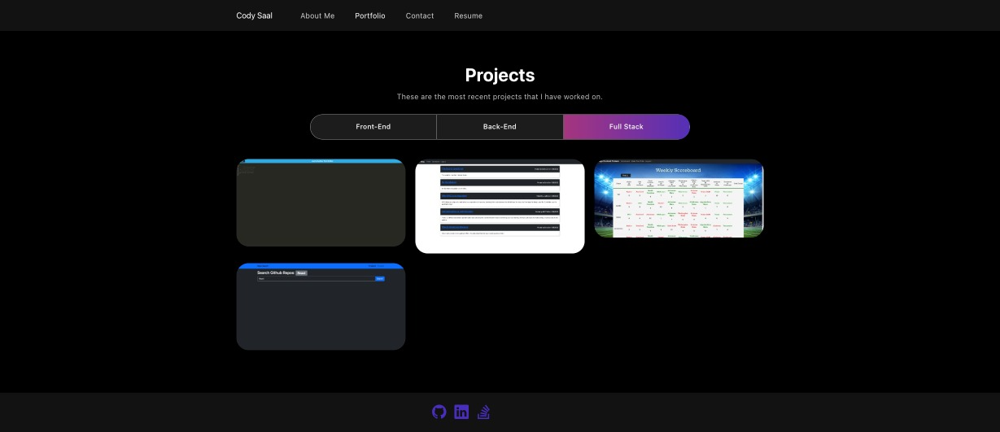

# React Portfolio

## Description

The purpose of this project was to practice using React. Building the project gave me the opportunity to work on making reusable componenets and working with state. This projects has only a front end so I was able to deploy it using Github Pages. This gave me more experience with using the gh-pages npm package. The application itself will be used to store all of my projects that I make so that future employers can see my ability.

## Table of Contents

- [Installation](#installation)
- [Usage](#usage)
- [Credits](#credits)
- [License](#license)

## Installation

The user can clone the code from the GitHub repo. Once the code is cloned and opened in a code editor the user should install all npm packages by running 
```
npm i
```
To invoke the application the user can run 

```
npm start
```

## Usage

This website is a portfolio for future employers to look at in order to see my skills and abilities.





[Portfolio](https://codysaal.github.io/react_portfolio "Deployed Portfolio")

## Credits

[README Template](https://coding-boot-camp.github.io/full-stack/github/professional-readme-guide 'Professional README Guide')

[Github Pages Deployment](https://create-react-app.dev/docs/deployment/ "Github Deployment Tutorial")

[WebDecoded Tutorial](https://www.youtube.com/watch?v=hYv6BM2fWd8&list=PLvbEHp7_5eirFhb3mdKZ62YGuL3L-GoNI&index=5&t=7s "webdecoded tutorial")

## License

N/A